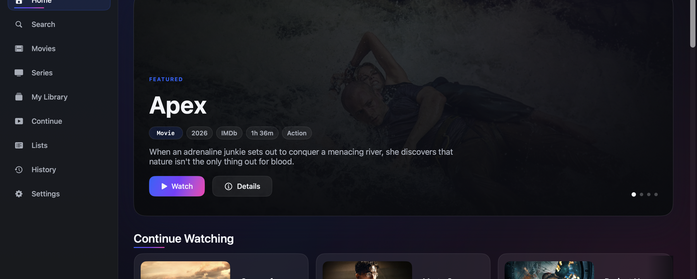
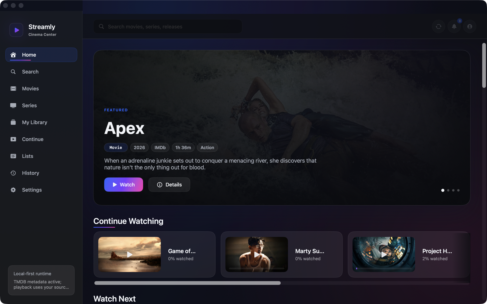
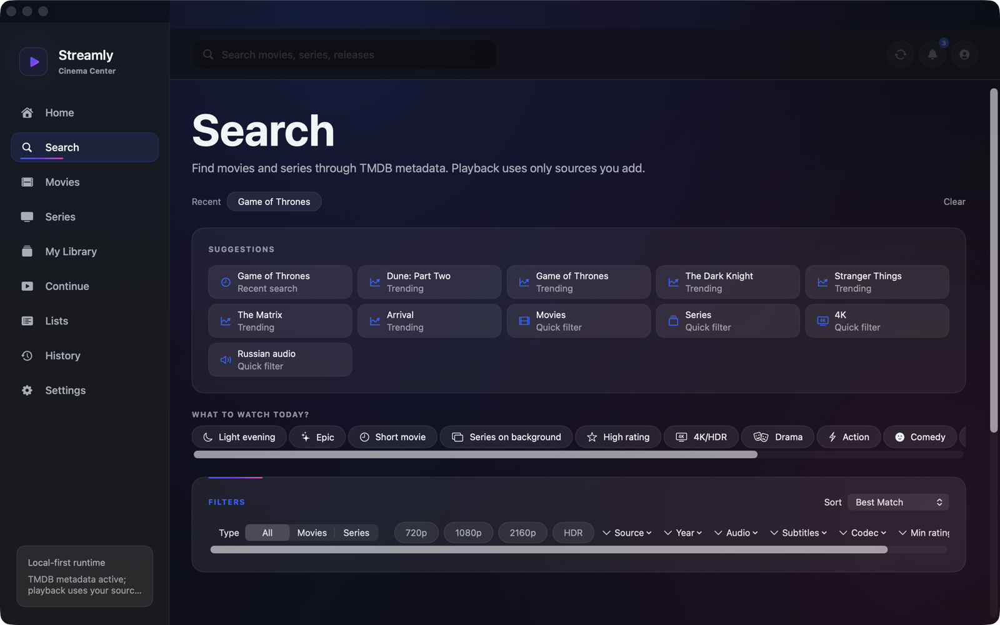
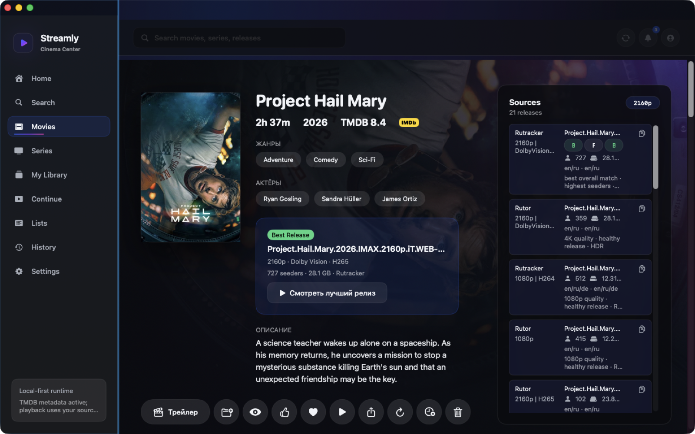
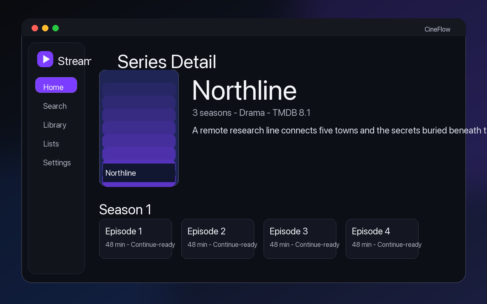
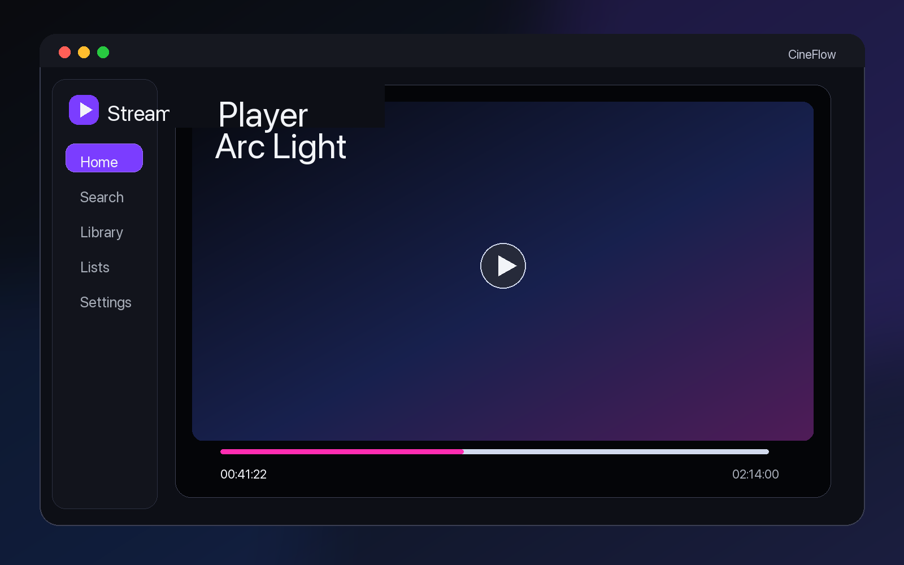
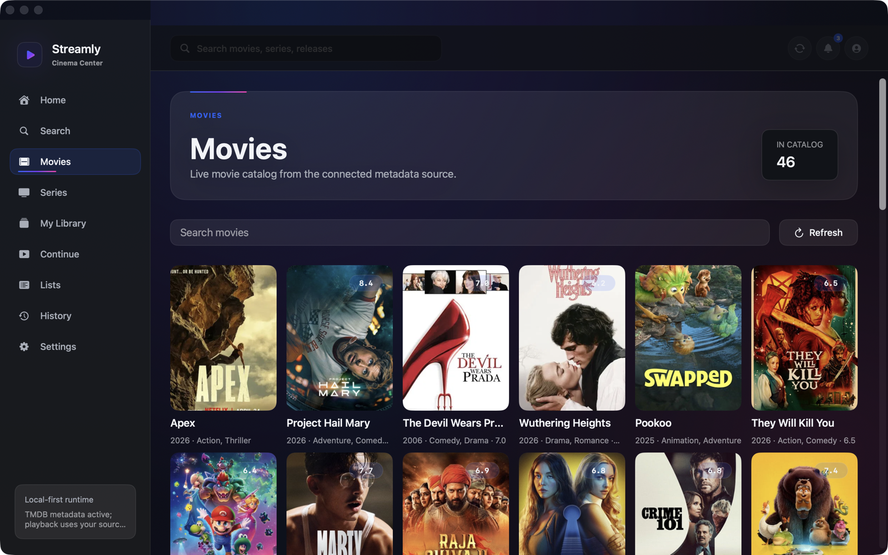
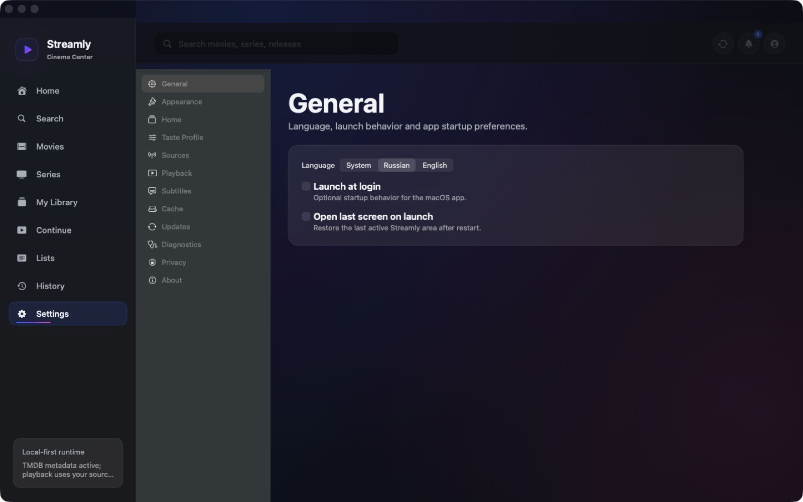

<p align="center">
  
</p>


<p align="center">
  <strong>A native macOS media client for cinematic discovery, user-controlled sources and local-first playback.</strong>
</p>

<p align="center">
  <a href="https://github.com/GanbarovEmin/streamly/releases/latest"></a>
  
  
  <a href="LICENSE"></a>
</p>



Streamly brings media discovery, source selection, playback, subtitles, library management and updates into one polished Apple Silicon app. It is built for people who want a desktop-first media experience without jumping between metadata sites, file managers, torrent tools and video players.

Streamly is the public app, Swift package and executable product name. Some legacy source targets still use `CineFlow*` implementation names until a separate module-graph migration renames them safely.

## What Makes Streamly Different

| Focus | What it means |
| --- | --- |
| Native macOS | SwiftUI interface, Apple-like navigation and a desktop-first layout. |
| Local-first | Library, watch history, settings, cache and diagnostics live on this Mac by default. |
| User-controlled sources | Streamly does not bundle media sources or host content. Playback uses sources the user configures. |
| Cinematic browsing | Dark media-first interface with shelves, posters, detail pages and Continue Watching. |
| Extensible core | Metadata, sources, torrent, playback, subtitles, updates and diagnostics are separated behind service layers. |

## Features

### Discovery

- Cinemeta/Stremio metadata integration with TMDB fallback.
- Movie and series search with posters, overviews, ratings and detail pages.
- Home, search, movie detail and series detail surfaces designed for fast browsing.
- Episode-aware series release lookup for compatible Stremio/Torrentio IDs.

### Sources and Playback

- User-controlled local files, magnet links and `.torrent` references.
- Torrentio source-provider integration for normalized release discovery.
- Release ranking by quality, seeders and source metadata.
- Torrent streaming through the bundled `CineFlowLibtorrentNative.xcframework` runtime.
- Native local-file playback through AVFoundation.
- mpv-capable playback bridge with AVFoundation fallback when no mpv runtime is available.

### Library

- Local library and favorites.
- Continue Watching.
- Watch history and playback progress.
- User lists and personal ratings.
- Local SQLite persistence through GRDB.

### Subtitles, Updates and Support

- Embedded, local `.srt` / `.ass`, and online subtitle workflows.
- Sparkle 2 auto-update integration backed by GitHub Releases.
- Local diagnostics logs and user-controlled diagnostics export.
- Privacy-aware redaction for support bundles.

## Screenshots

| Home | Search |
| --- | --- |
|  |  |

| Movie Detail | Series Detail |
| --- | --- |
|  |  |

| Player | Library | Settings |
| --- | --- | --- |
|  |  |  |

The screenshot set is intentionally kept in `docs/screenshots/` so the GitHub page can be refreshed with real release captures without changing the README structure.

## Architecture

Streamly is a SwiftPM-based macOS app with a modular service-oriented architecture:

```text
CineFlowApp          App entry point
CineFlowUI           SwiftUI screens, view models and navigation
CineFlowDesignSystem Visual tokens and reusable UI primitives
CineFlowCore         Shared models, protocols and app environment
CineFlowMetadata     Cinemeta/TMDB discovery and metadata mapping
CineFlowSources      Source-provider catalog, Torrentio and credential policy
CineFlowTorrent      Torrent engine abstraction and native libtorrent bridge
CineFlowPlayback     AVFoundation/mpv playback services
CineFlowSubtitles    Subtitle matching, loading and cache workflows
CineFlowDatabase     GRDB repositories and local persistence
CineFlowUpdater      Sparkle and GitHub Releases update services
CineFlowDiagnostics  Local logs and sanitized diagnostics export
```

The UI talks to view models and service protocols, not directly to provider APIs, libtorrent, playback internals or SQLite. That keeps source providers, metadata providers and playback engines replaceable without rewriting the product surface.

## Installation

1. Download the latest `.dmg` from [GitHub Releases](https://github.com/GanbarovEmin/streamly/releases/latest).
2. Open the `.dmg`.
3. Drag `Streamly.app` to `Applications`.
4. Launch the app from `Applications`.

If macOS blocks an unsigned or not-yet-notarized build, open **System Settings -> Privacy & Security**, find the Streamly warning and choose **Open Anyway**. You can also Control-click the app, choose **Open**, then confirm.

See [Installation](docs/installation.md) for uninstall steps and local data locations.

## System Requirements

- macOS 13.0 or newer.
- Apple Silicon Mac: M1, M2, M3, M4 or newer.
- Internet connection for metadata, source lookup and release updates.
- Free disk space for local app data, image cache, torrent cache, subtitles and diagnostics exports.

## Build Locally

```bash
swift build
swift test
swift run Streamly
```

Release packaging scripts live in `script/`:

```bash
bash script/build_release.sh
bash script/create_dmg.sh
```

## Privacy

Streamly is local-first:

- No telemetry is enabled by default.
- Library, watch history, settings and cache data are stored locally.
- User credentials and API tokens are stored through macOS Keychain where supported.
- Diagnostics export is user-controlled and created locally.
- Logs and diagnostics should redact secrets, private source URLs and magnet links.

See [Privacy](docs/privacy.md) for details.

## Legal Note

Streamly does not host, provide, sell or bundle media content. Streamly is a media client for user-controlled sources and local data. Users are responsible for the sources they configure and for complying with applicable law and content rights.

Streamly does not bypass DRM, paywalls, captchas or technical access controls.

See [Legal](docs/legal.md) for details.

## Roadmap

- v1.0 Apple Silicon macOS release.
- Signed and notarized `.dmg` distribution.
- Sparkle 2 appcast updates.
- More source providers.
- More subtitle providers.
- Plugin system after v1.0.
- Optional account and sync layer after v1.0.
- More detailed diagnostics export tools.

## Links

- [Landing Page](https://ganbarovemin.github.io/streamly/)
- [Latest Release](https://github.com/GanbarovEmin/streamly/releases/latest)
- [Changelog](CHANGELOG.md)
- [Installation](docs/installation.md)
- [Updates](docs/updates.md)
- [Privacy](docs/privacy.md)
- [Legal](docs/legal.md)
- [Security](SECURITY.md)
- [Contributing](CONTRIBUTING.md)

## License

Streamly is released under the [MIT License](LICENSE).
